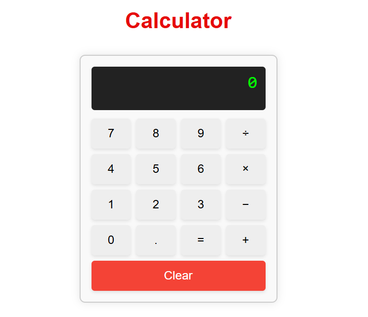

# 🧮 React Calculator App

A simple calculator built with **React.js** and **CSS**, supporting basic arithmetic operations: addition, subtraction, multiplication, and division.

## 🚀 Features

- Basic operations: `+`, `−`, `×`, `÷`
- Clear button to reset the input
- Decimal support
- Real-time result on pressing `=`
- Responsive design
- Clean UI with accessible layout

## 🖥️ Demo

 <!-- Replace with your actual screenshot if you have one -->

## 📁 Project Structure

